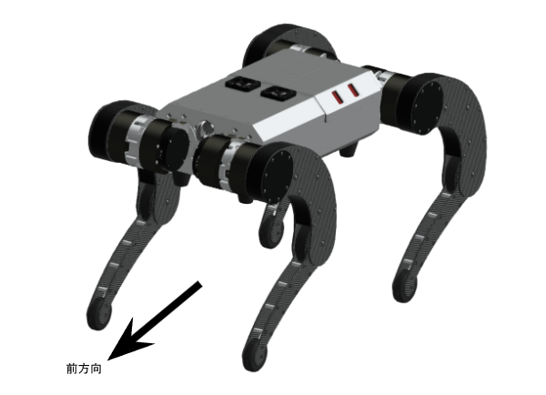
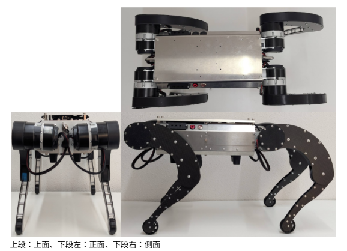
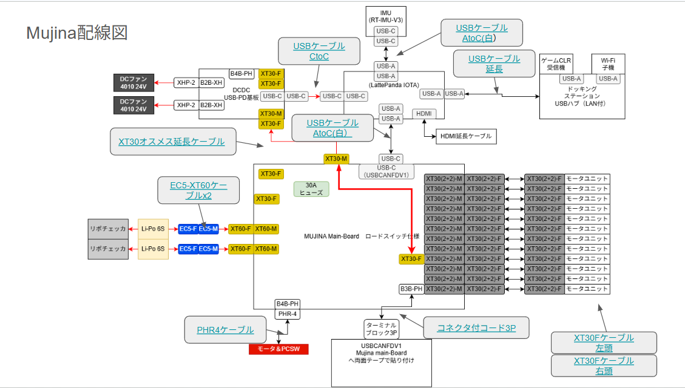
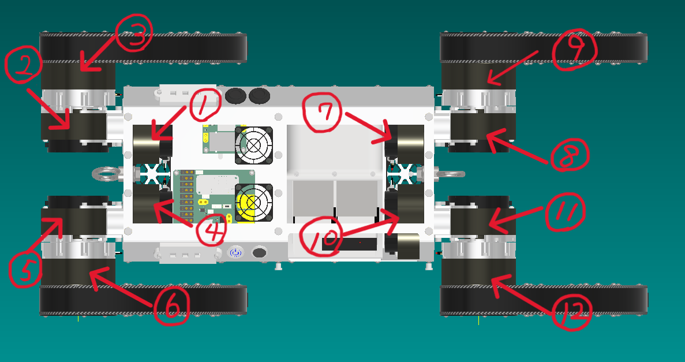
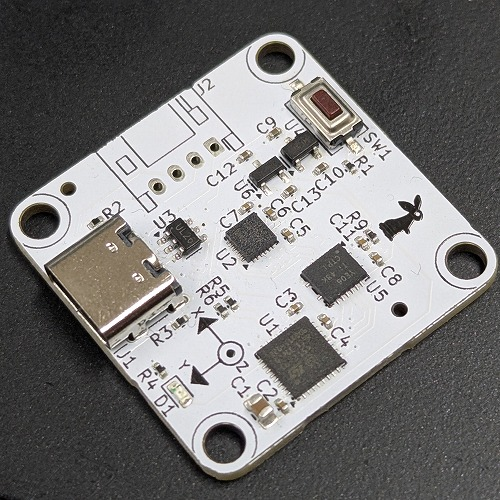
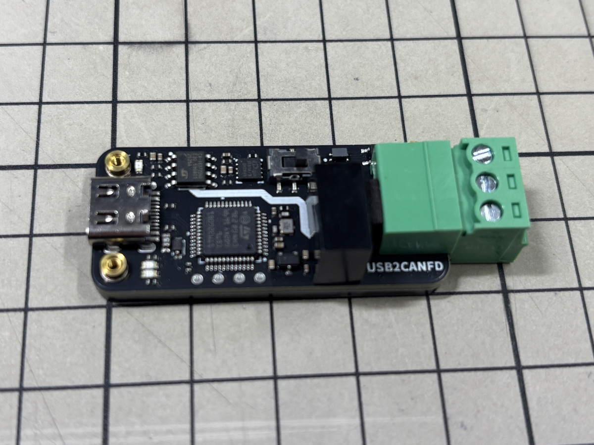
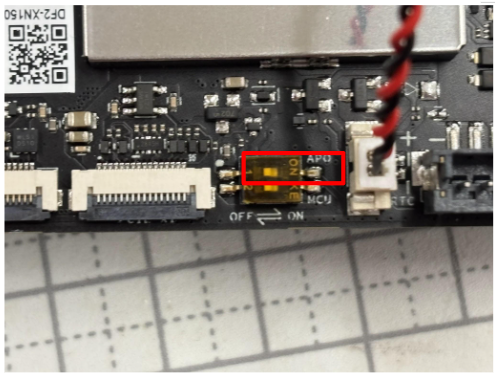
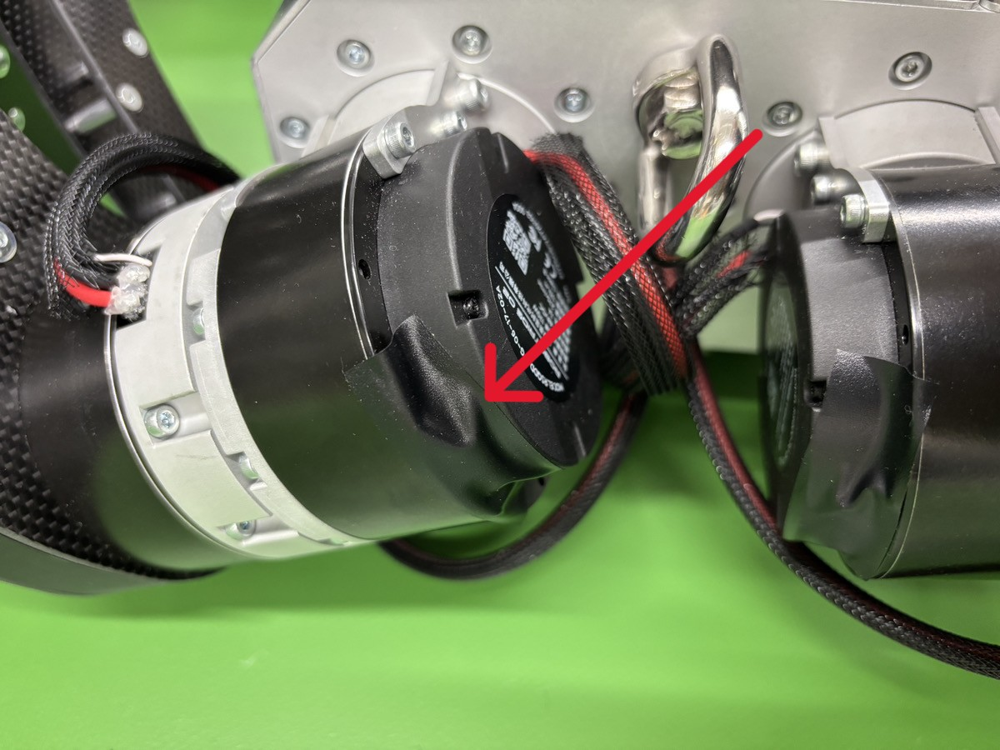

## 完成写真

## 配線図

## 組立時注意点

 ### モーターID書き込み、ファームウェアアップデート
 MujinaのモーターIDの割り振りは画像のようになっています。
 IDの書き込み、ファームウェアアップデートについては[「motor_tool.md」](./motor_tool.md)を参照してください。

 ### ファームウェアの書き込み
   [USB出力9軸IMUセンサモジュールV3](https://www.rt-shop.jp/index.php?main_page=product_info&products_id=4247)と[「WeAct」USB-CANFDインタフェース](https://btoshop.jp/products/wa00013?srsltid=AfmBOooY02QRYLmUcxocVz3foPxRkKsoYWfWiYbLFpCIFLpd5vDMbJIA)はファームウェアの書き込みが必要です。[「firmware.md」](./firmware.md)を参照し、書き込み後、機体へ組み込んでください。
   

 ### LATTEPANDA IOTAの準備
 Mujinaは[「LATTEPANDA」](https://www.lattepanda.com/lattepanda-iota)を内蔵します。組み立てる前に[Mujina_ros](https://github.com/rt-net/mujina_ros/blob/main/README.md)のREADMEを参照しPCのセットアップを行ってください。

 - AUTO Power ONの設定
   - LATTEPANDAはデフォルトでは本体側面のスイッチ手電源を入れますが、本体に内蔵してしまうため電源投入時に自動で起動する設定を行う必要があります。「Auto Power-On」の公式ドキュメントは[こちら](https://docs.lattepanda.com/content/iota_edition/auto_power_on/)です。

  写真赤枠のスイッチをONにすると電源投入と同時にPCは起動します。

  Mujinaへの組み込みは[lattepanda.md](./lattepanda.md)を参照してください。

### 配線
Mujina同体内、モーターケーブル等の配線は、[cable.md](./cable.md)を参照してください。

#### ※モーターケーブルを接続していないモーターのXT30（2＋2）コネクタは絶縁処理を行ってください。

 
  