### 配線
 配線図を参照しながら配線してください。
  #### LATTEPANDA IOTAへの配線

   1. USBケーブル（白2本）USB延長ケーブルを取り付ける。
   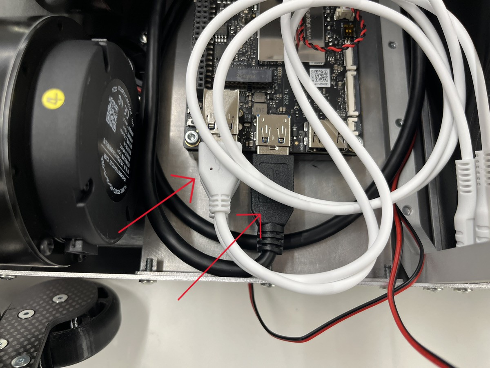

   1. USBケーブル（CtoC 黒）を画像の矢印の箇所へ取り付ける。
   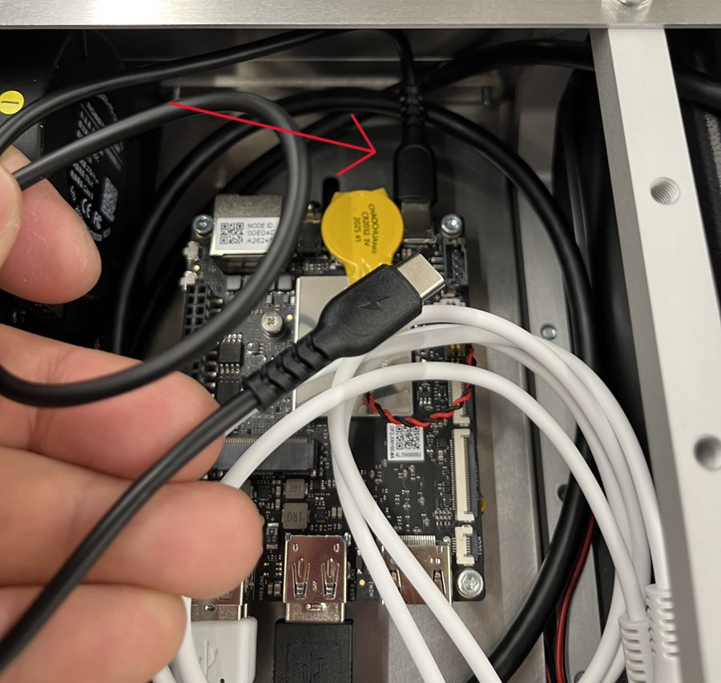

   1. HDMI延長ケーブルを取り付ける。
   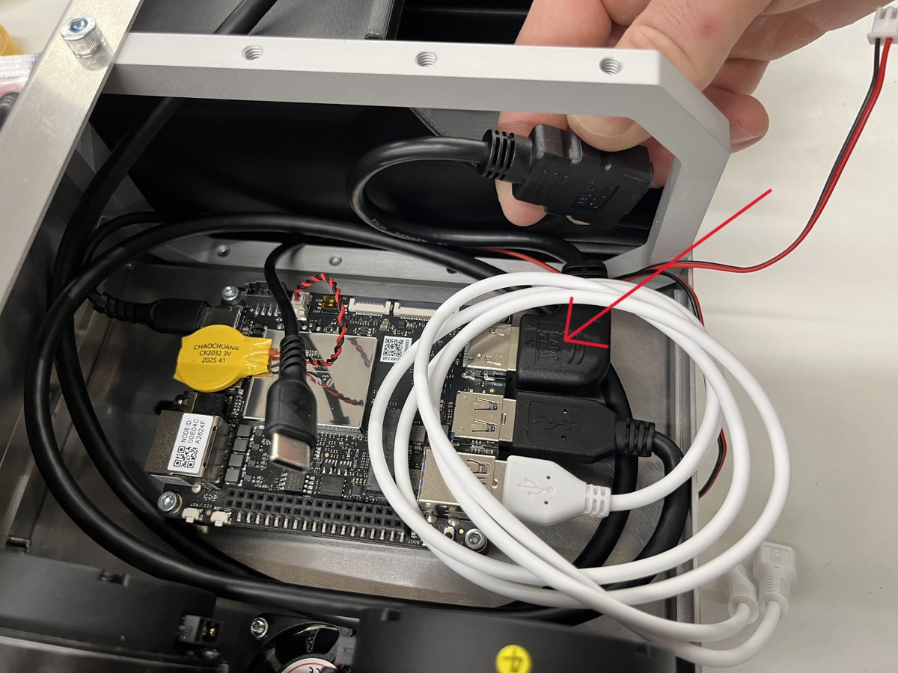
   #### 各基板への配線

   1. 「USB出力9軸IMUセンサモジュールV3」と接続（USBケーブル（白））
   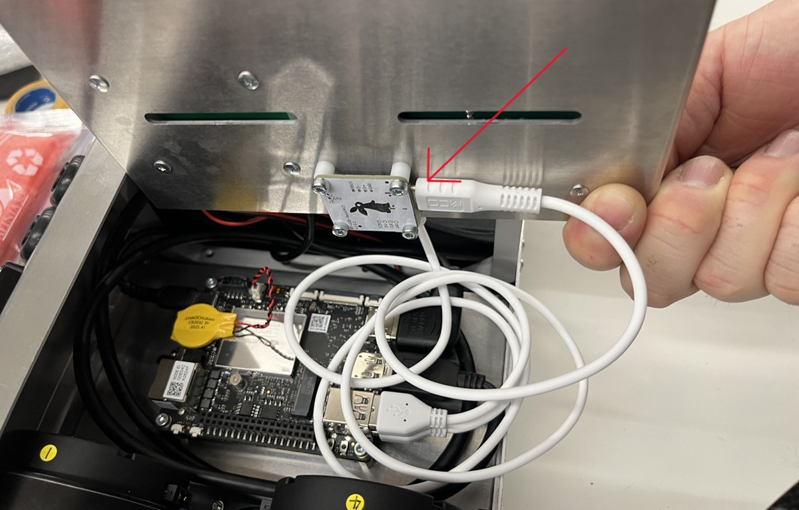

   1. PH3ピンケーブルを50㎜程にカットしUSBCANインターフェースに付くターミナルブロックへ取り付ける。（CANH、CANL、GNDを基板とインターフェースとで確認しながら取り付ける）
   2. USBCANインターフェースは基板へ両面テープで取り付ける。
   
   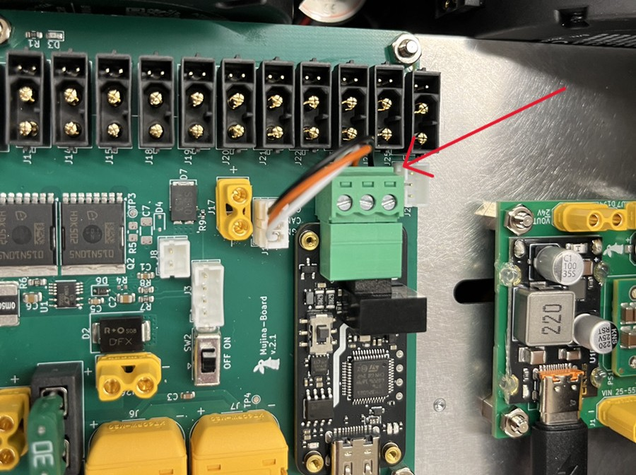
   

   3. LATTEPANDA IOTA→USBケーブル（白）→USB-CANFDインタフェース➀
   4. LATTEPANDA IOTA→USBケーブル（CtoC黒）→DCDC48to24V-USB-PD②
   5. DCファンケーブル→DCDC48to24V-USB-PD③
   
   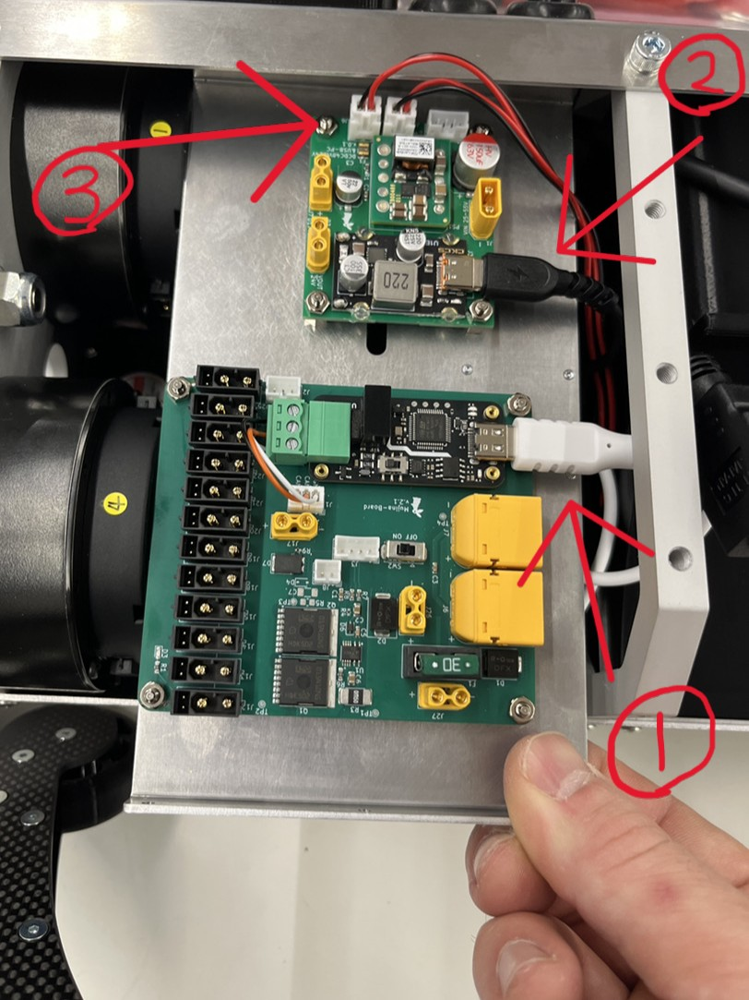
   

   XT30オスメスケーブルを取り付ける。
   ##### ※必ず写真の位置で取り付けを行うこと。手前基板の赤×の2か所へは取り付けしないでください。
   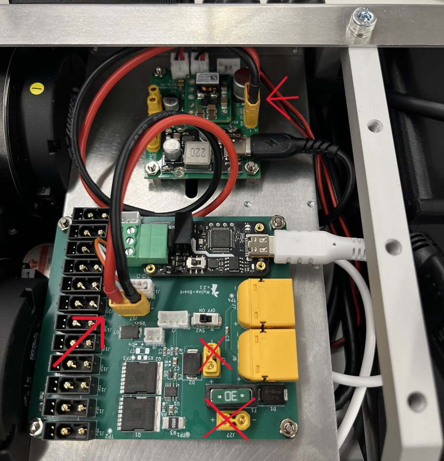

#### モーターケーブルの配線

   1. モーターケーブル右頭350㎜
   1. モーターケーブル左頭250㎜
   1. モーターケーブル左頭250㎜
   1. モーターケーブル右頭350㎜
   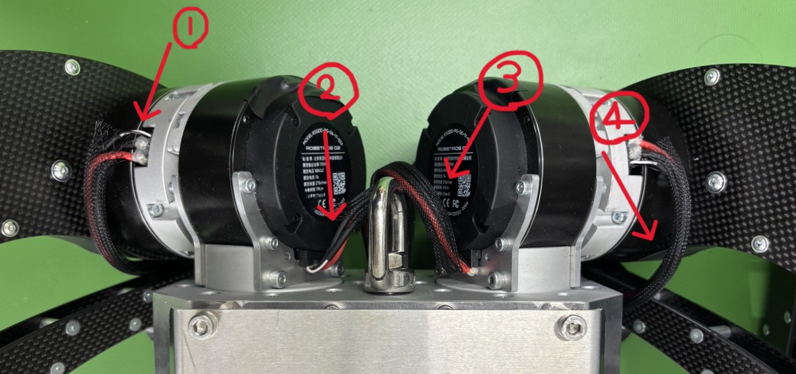
   
   2. モーターケーブル右頭600㎜
   3. モーターケーブル左頭450㎜
   4. モーターケーブル左頭450㎜
   5. モーターケーブル右頭600㎜
   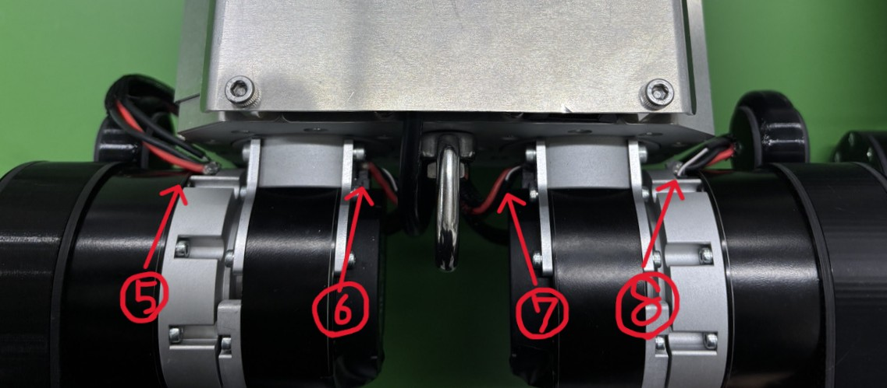
 
   6. モーターケーブル左頭150㎜
   7. モーターケーブル左頭150㎜
   8. モーターケーブル左頭350㎜
   9.  モーターケーブル左頭350㎜
     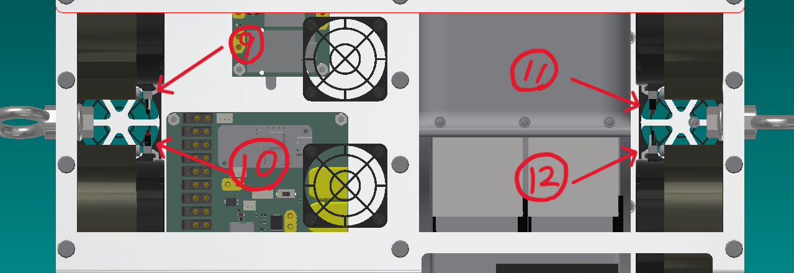

   基板のXT30(2+2)と前後のモーターをそれぞれモーターケーブルを接続する。

   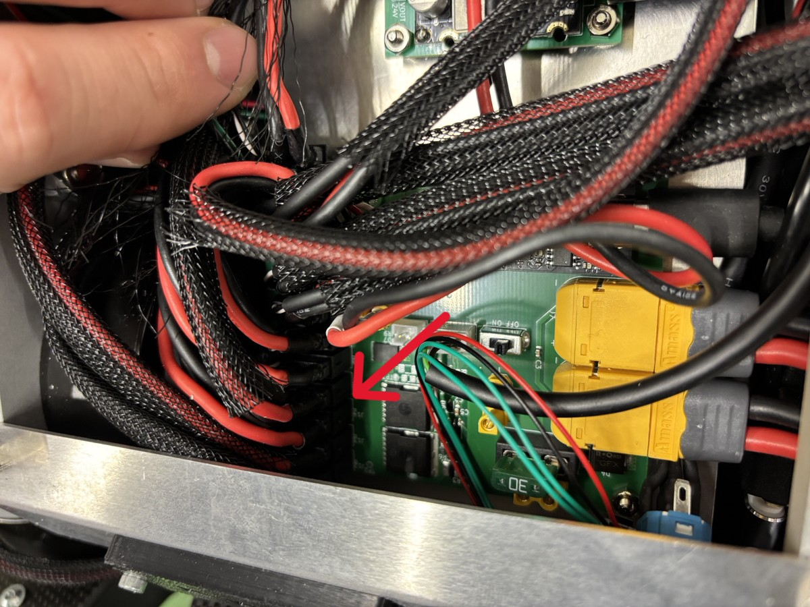

   後方のモーターケーブル、USB延長ケーブルはバッテリーケースの上部を画像のように通す。

   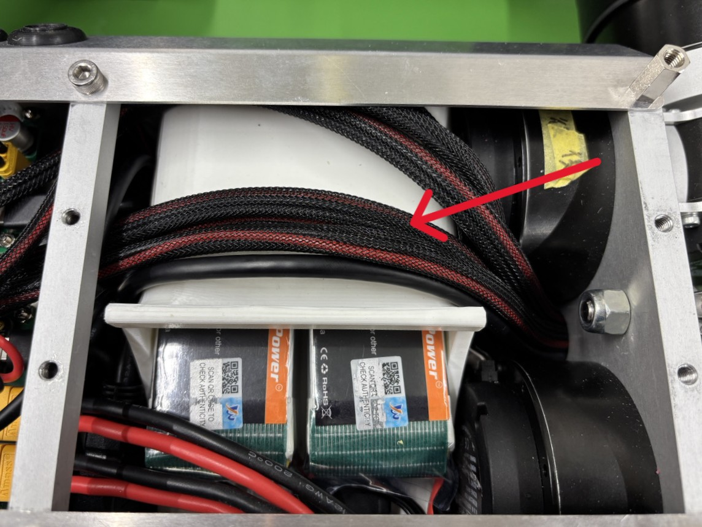

   電源ボタンケーブルの取り付け（赤矢印）、隣の押しボタンケーブルは本バージョンでは使用しません。（青矢印）配線端を絶縁処理のうえ取り付けください。

   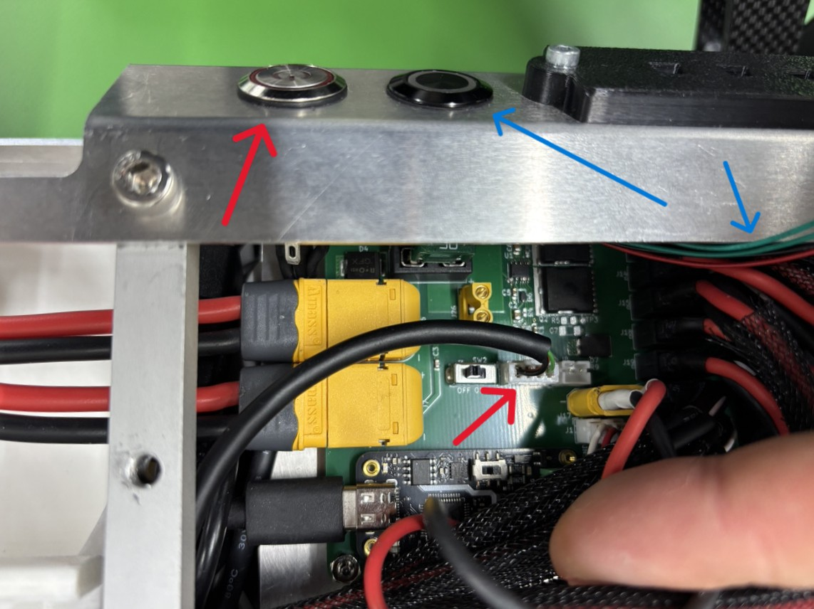

EC5toXT60ケーブルを2本取り付ける。

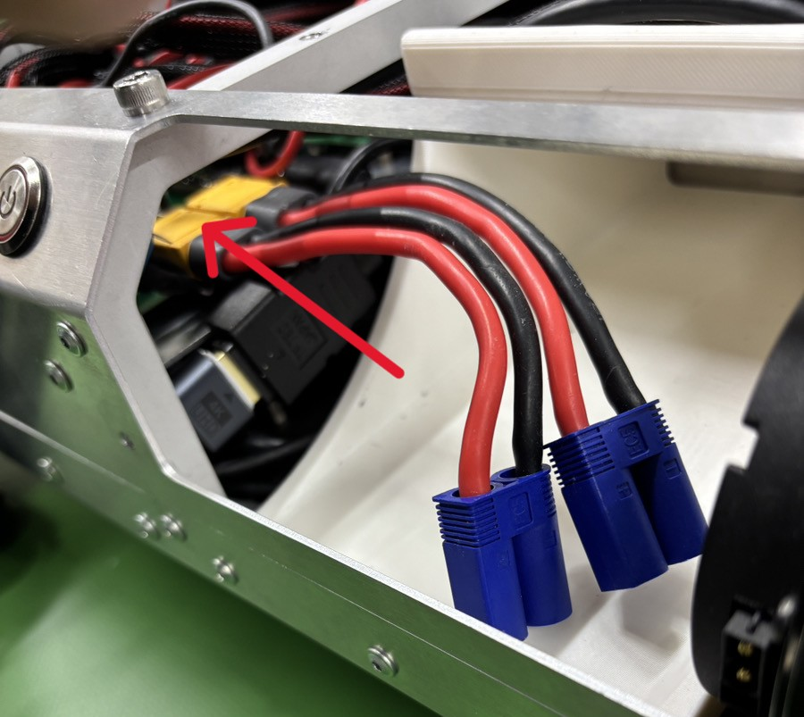

   USBハブは両面テープにて取り付けてください。開発状況により、ゲームコントローラーに付属するUSB延長ケーブルも併せてご使用ください。
   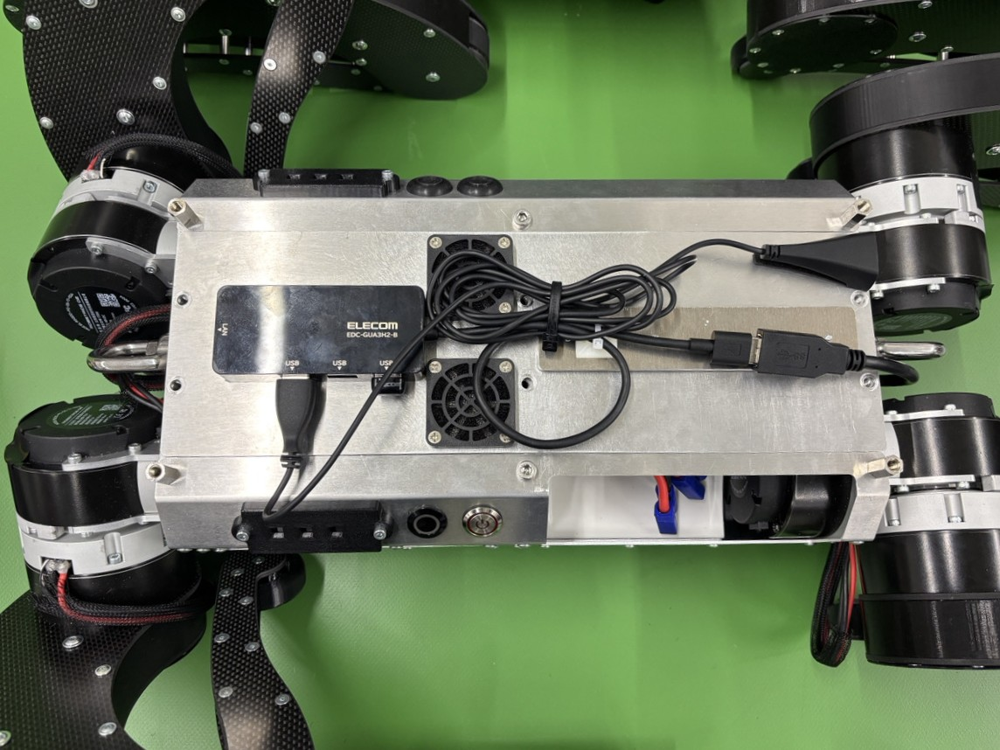
