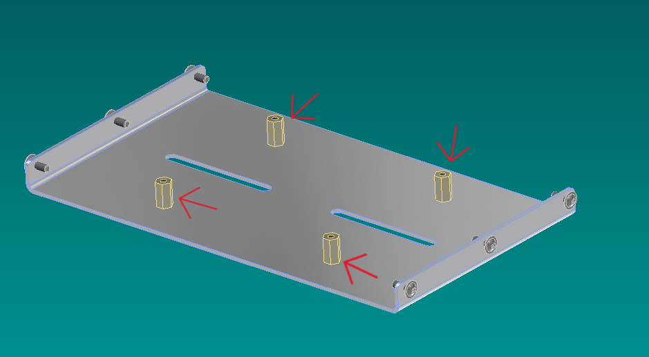
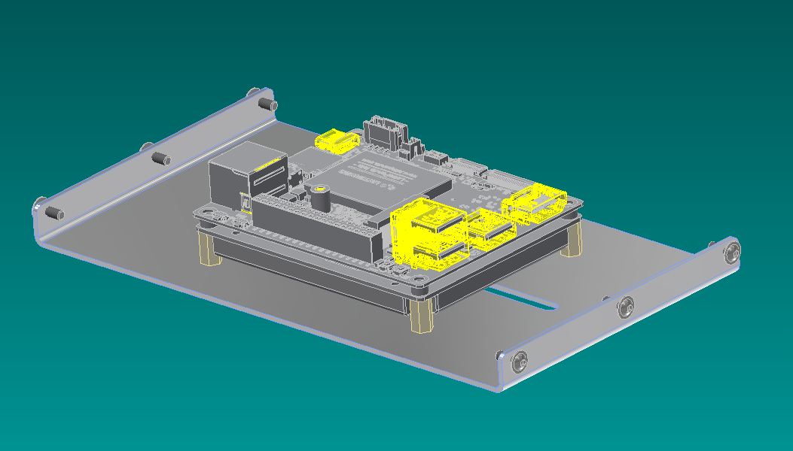
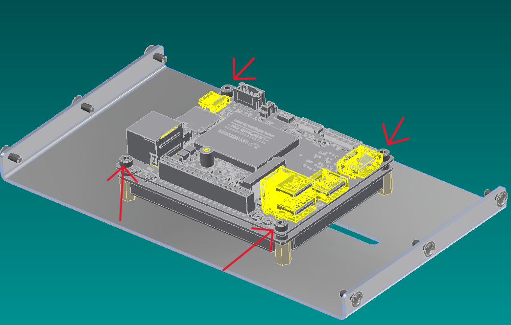
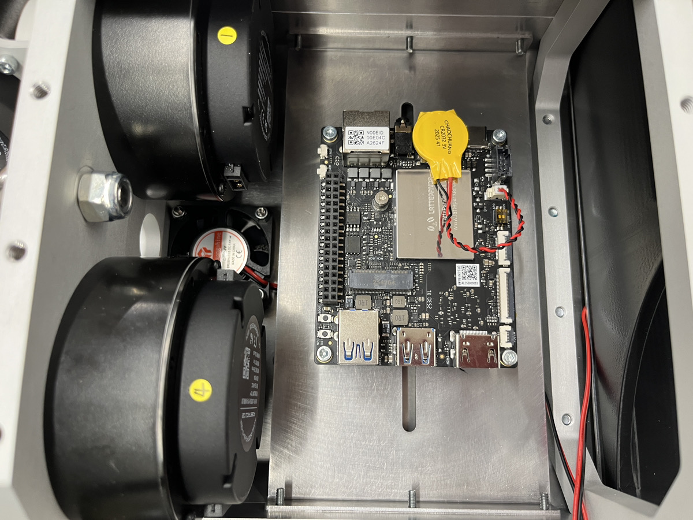

 ### LATTEPANDA IOTAの組み込み
 「RT-Mujina.stp」にはLATTEPANDA IOTAのモデルが含まれていません。
 下記画像を参考に取り付けをしてください。

1. 「黄銅スペーサー（BSB-310E）」を「FrameBodyInner」へ4か所取り付ける。

1. LATTEPANDA IOTAをマウントする。（ピンソケットが出る方が機体前方へ向きます）

1. 六角穴付きボルトM3x10にて4か所ねじ止めし固定する。

1. 画像のように取り付く。（画像の向かって左側が機体前方となる
