### RobStrideRS02 ID書き込み、ファームウェアアップデート手順

#### 書き込みツールのダウンロード
 
  1. RobStrideのリポジトリから[ダウンロード](https://github.com/RobStride/MotorStudio/releases/tag/v1.0.2)
   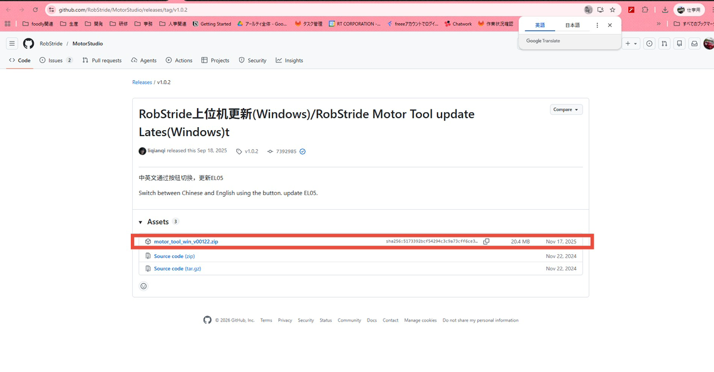

  2. ZIPファイル解凍して中の「motor_tool.exe」実行する。
   
  3. 初回起動時にWindowsの警告が出る。
  
  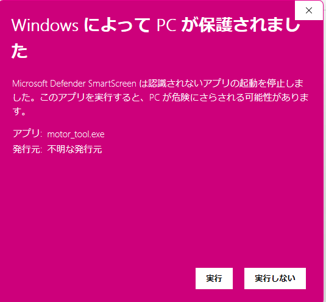

  ホーム画面。
  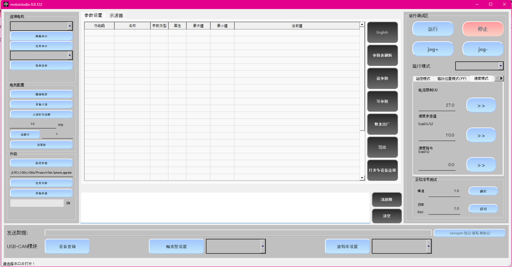

#### 準備
  
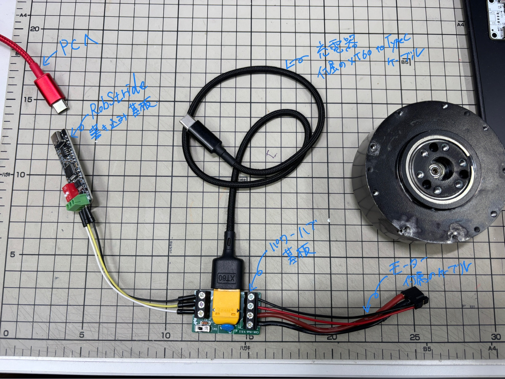

  ##### 準備物
  1. モーター
  2. モータ付属のモーター接続ケーブル
  3. 充電器付属のXT60→TypeCケーブル
  4. RT製電源ハブ基板
  5. RobStride書き込み基板
  6. 接続用ジャンパ線
  
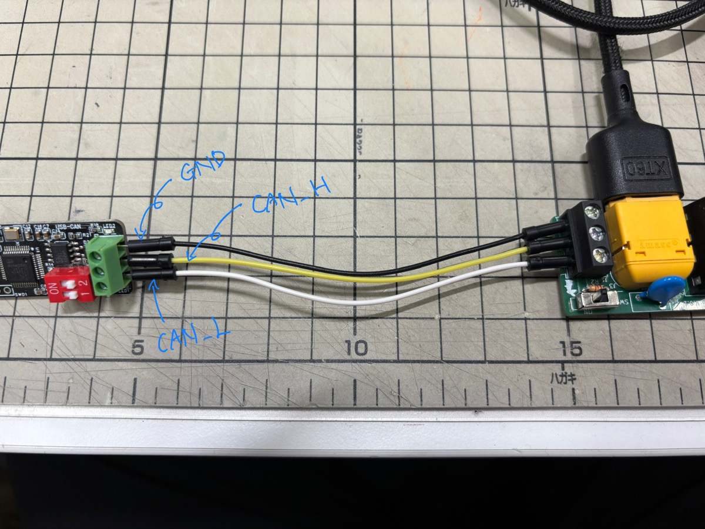

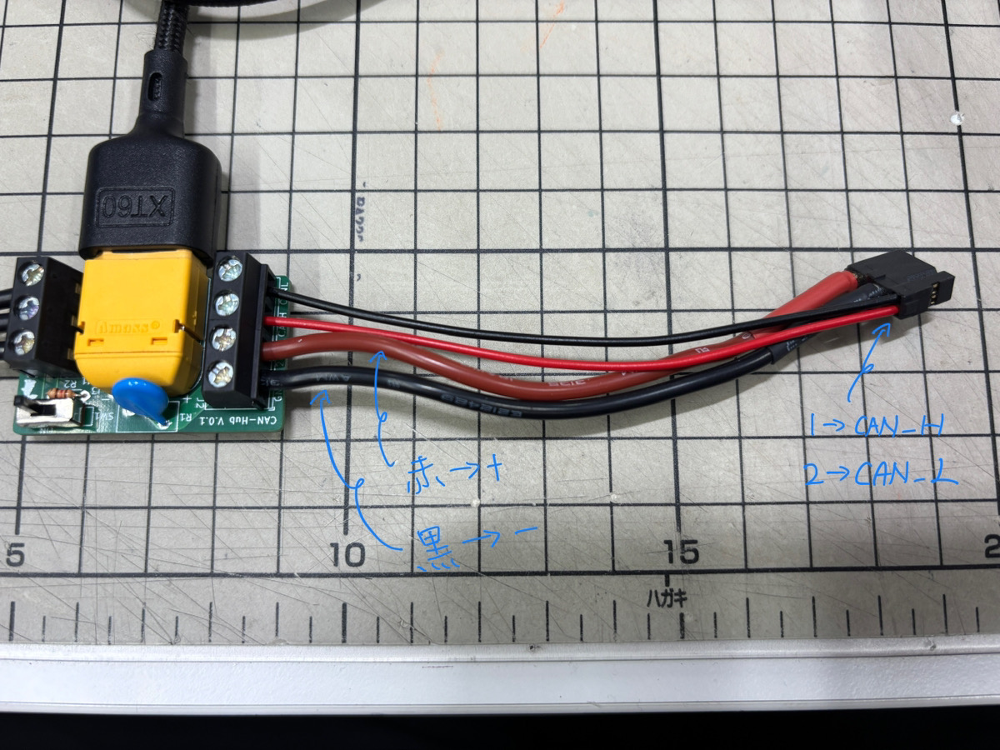

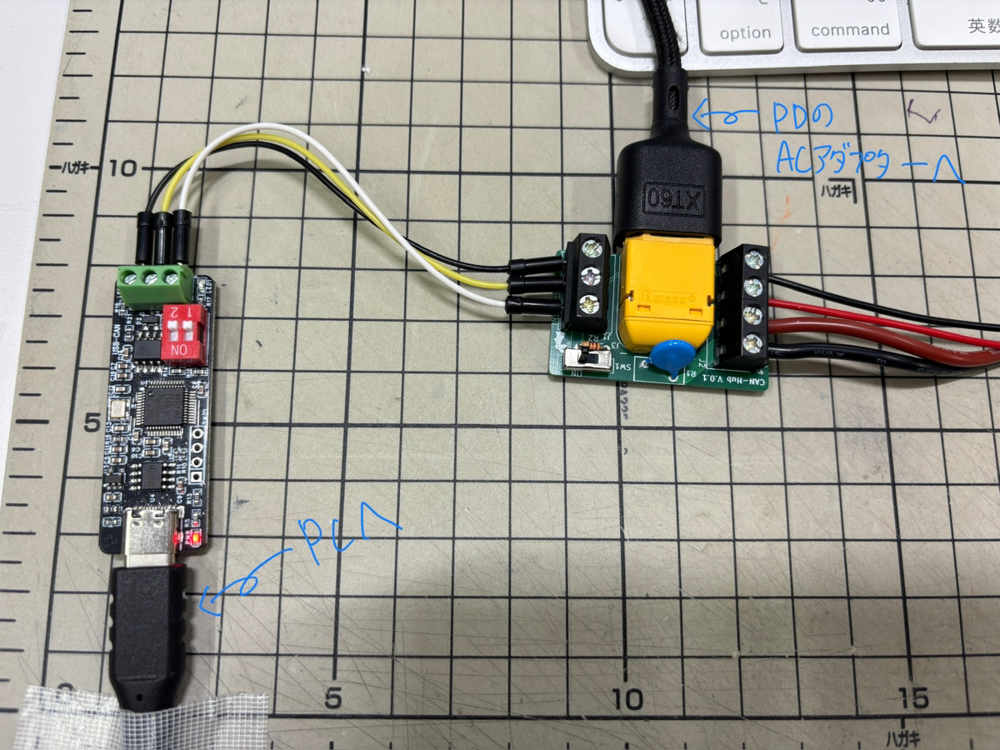

接続は上記写真を参考に行ってください。
#### PCからモーターへアクセス

1. 言語を中文から英語へ変更する。  
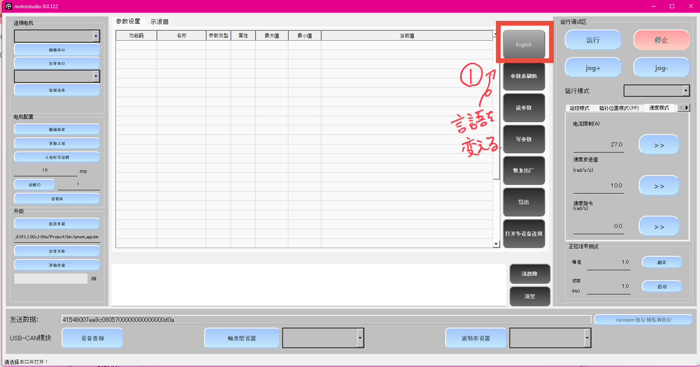

1. モーター、書き込み基板等をすべて接続したあと「RefreshCOM」をクリックすると上のボックスに接続されたCOMPortが表示される。
2. 「Open Serial Port」をクリックして電源につないだケーブルを一度抜き挿しするとCANのIDが表示される。
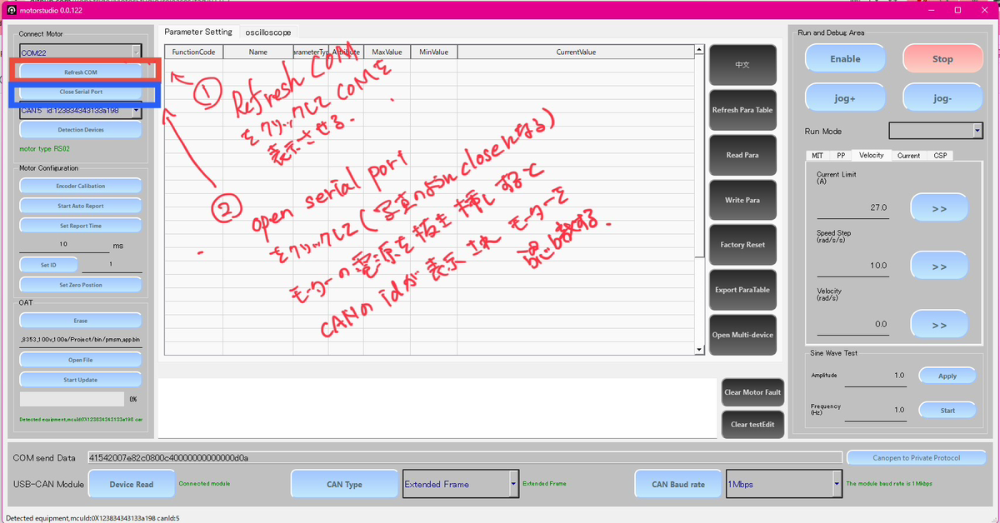

1. 「RefreshPara Table」をクリックするパラメーターの一覧が表示される。
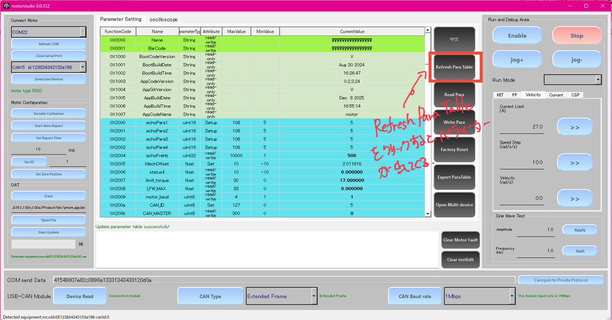

#### CANIDの書き込み
  

1. 左の操作パネル「Motor Configration」の「Set ID」横の数字をクリックし書き込みたい数字を入力する。
2. 「Set ID」をクリック
3. 「RefreshPara Table」をクリックするとテーブルが更新されてIDの変更が確認できる。
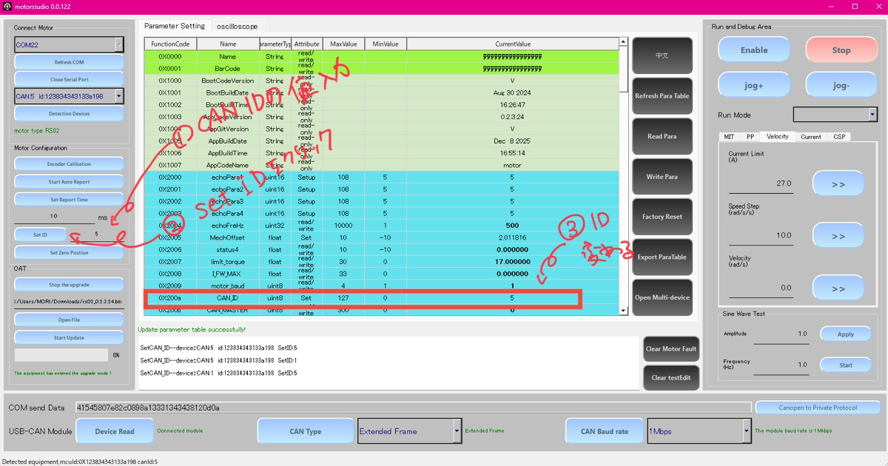

#### ファームウェアの書き換え

1. [サイト](https://github.com/RobStride/Product_Information/releases)からファームウェア[「rs02_0.2.3.24.bin」](https://github.com/RobStride/Product_Information/releases/download/V25.12.09/rs02_0.2.3.24.bin)をダウンロードする。
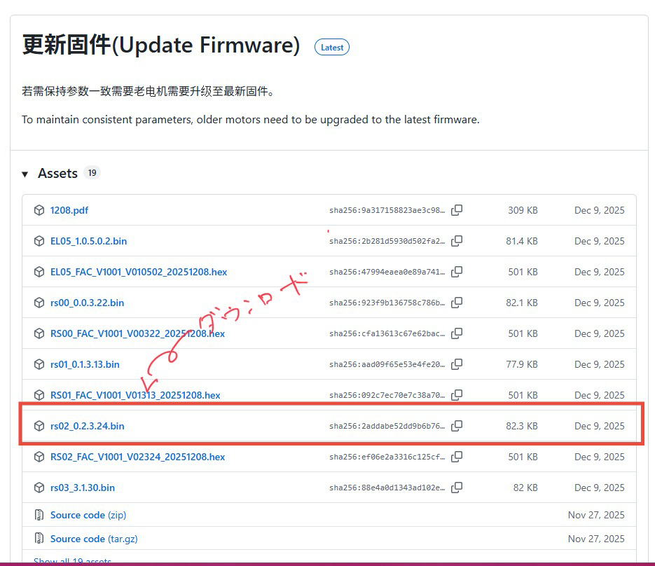

1. 操作パネル左の「OAT」からはじめに「erase」をクリックする。
1. 「open file」をクリックし、先ほどダウンロードしたbinファイルを選択して開く
1. 「start update」をクリックするとアップデートが開始する。緑のゲージが100％まで到達するとアップデート完了する。
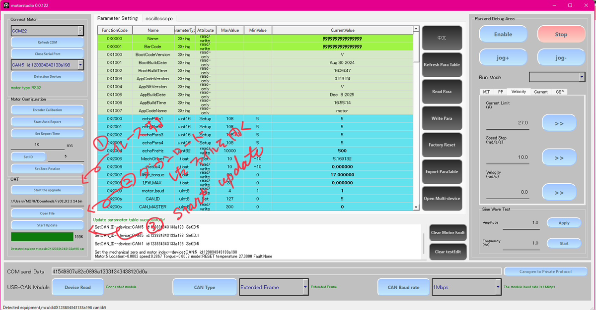
